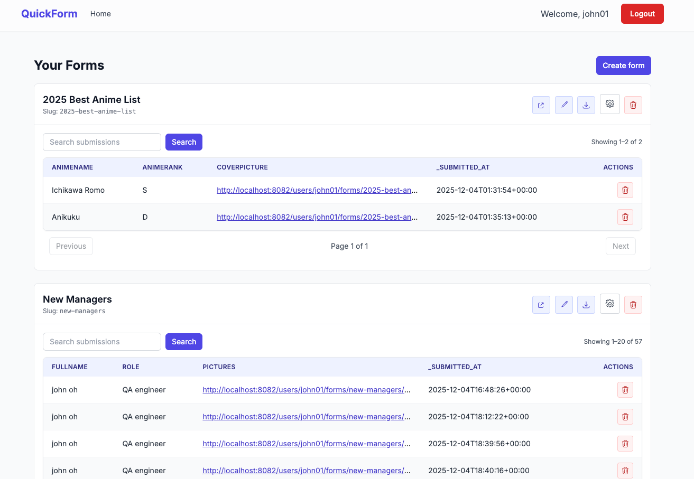
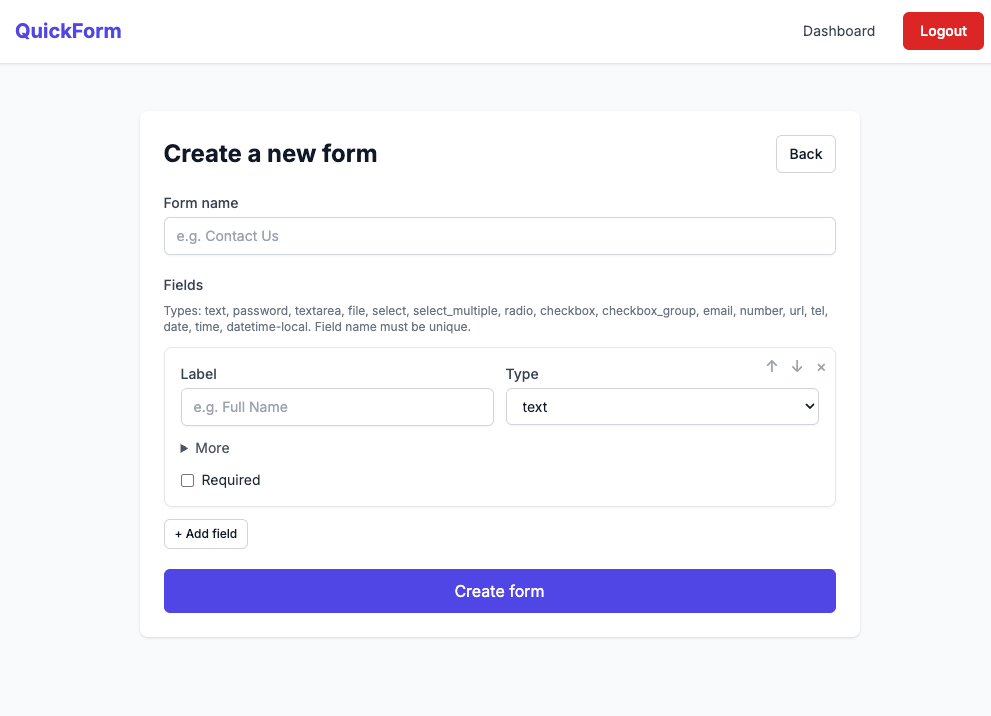
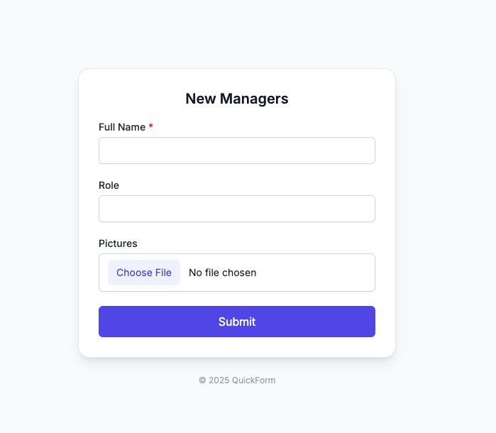
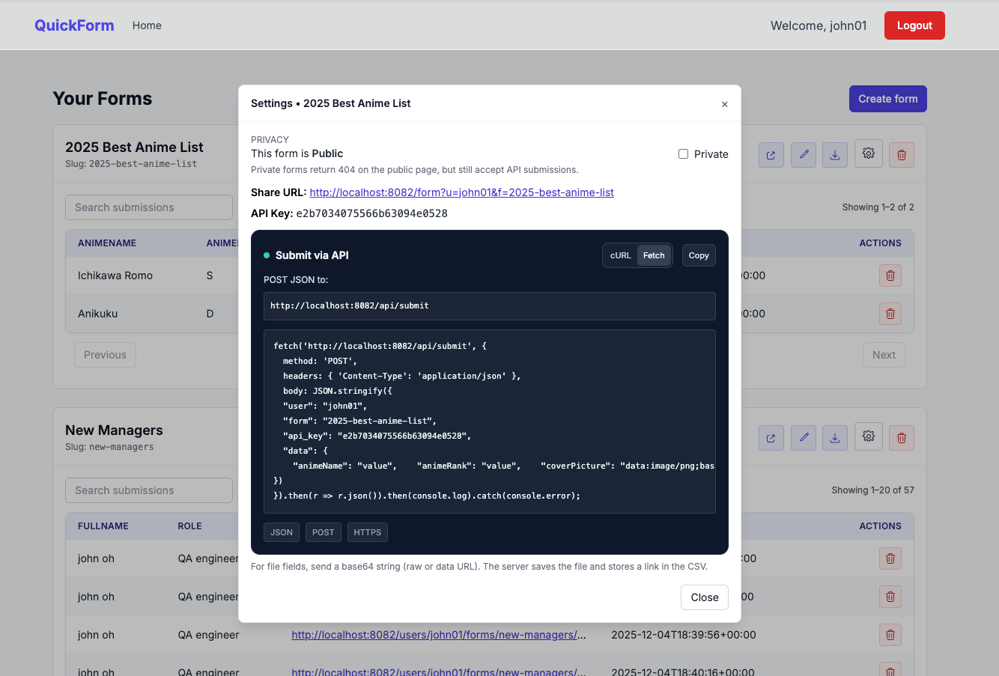
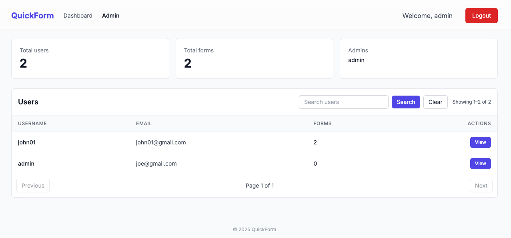

# Widgets Top — File‑based Forms

Widgets Top is an open‑source questionnaire and data‑collection tool. It lets you:

- Build forms (like Google Forms) with fields arranged vertically.
- Share a public URL to collect responses from anyone.
- Accept submissions through an HTTP JSON API (including base64 file uploads).
- Store everything on the filesystem — no database required.
- View submissions in your dashboard and download them as CSV.

Repository: https://github.com/kudium/quickform — Licensed under MIT. Feel free to fork and improve.

## Performance at a Glance

- Filesystem writes are fast: local append is typically around ~5 ms per submission on a laptop class SSD.
- Databases add overhead: network hop, protocol, pooling, and query planner often make inserts 15–30+ ms in practice.
- Real‑world results vary: hosting, network, and disk I/O substantially affect latency.

On the homepage, we surface this with a small “≈ 5 ms local write” badge and a live benchmark readout.

## Screenshots

- Dashboard

  

- Form Builder

  

- Sample Form

  

- API Submission Example

  

- Admin Area

  

## Project Structure

- `server/` — Core server logic (auth, forms, utils). Entry scripts include these files.
  - `bootstrap.php` — Defines `APP_ROOT`, `USERS_DIR`, and shared setup.
  - `auth.php` — Authentication and user management.
  - `forms.php` — Form CRUD, submissions, CSV I/O, encryption.
  - `utils.php` — URL/path helpers and upload safety checks.
- `lib/` — Backward‑compatibility shims that load `server/` equivalents.
- `*.php` in project root — Entry points (UI pages, API endpoints) that call into `server/` APIs.

This layout keeps logic separate from pages, making the app easier to maintain and portable to other front‑ends.

## Highlights

- Flat‑file storage: per‑user folders hold forms, CSVs, and uploads.
- Form fields: text, password, textarea, file, and select (with options).
- Public forms: modern, small card layout, centered.
- API: post JSON to add rows (files as base64 become actual files, linked in CSV).
- Download CSV: quick export of all responses per form.

## Security

- Encrypted at rest: Each form’s CSV is obfuscated using authenticated user material.
- How it works: The app derives a 256‑bit key from the user’s stored password hash and username, then encrypts each CSV line with AES‑256‑CBC and a random IV. Lines are stored as `ENCv1:<base64-iv>:<base64-cipher>`.
- Private by default: When you view submissions in the Dashboard, the app decrypts on the fly after you’ve authenticated.
- Safe downloads: If someone downloads the CSV directly, they’ll see encrypted lines — not raw answers.
- Note: Changing a user’s password changes the derived key. If you need seamless key rotation for existing CSVs, add a simple migration step on password change to re‑encrypt files with the new key.
 - Private exports: From the Dashboard, you can download a decrypted CSV (requires login) or the raw encrypted CSV.

## How It Works

- Users authenticate via file‑based auth (no DB). Each user has a folder under `users/<username>/` containing configuration.
- Each form lives under `users/<username>/forms/<slug>/` with:
  - `form.json` — form metadata and fields
  - `data.csv` — CSV of submissions
  - `uploads/` — any files uploaded through file fields or the API
- The public share link renders `/public/form?u=<username>&f=<slug>`.
- The API endpoint is `public/api_submit.php` (or `api_submit.php` if docroot is `public/`) and accepts JSON.

## Requirements

- PHP 8.1+ recommended.
- A writable filesystem for the project directory (so it can create `users/` and form folders).

## Getting Started (Local)

1. Clone the repo
   git clone https://github.com/kudium/quickform
   cd widgets

2. Start the PHP dev server
   Pretty routes (recommended):
   php -S localhost:8000 -t public public/router.php

   Simpler (no router):
   php -S localhost:8000 -t public

3. Visit the app
   http://localhost:8000/

4. Create an account
- Register, log in, then click “Create form”.

## Optional: Benchmark Endpoint

You can enable a small benchmark endpoint to measure p50/p95 filesystem append times on your server. It is disabled by default.

- Enable
  - macOS/Linux (one‑off): `BENCH_ENABLED=1 php -S localhost:8000 -t public public/router.php`
  - macOS/Linux (current shell): `export BENCH_ENABLED=1`
  - Production: set `BENCH_ENABLED=1` in your process manager or web server env

- Use
  - CSV path (encrypted append): `GET /bench?mode=csv&n=30`
  - Raw append to tmp: `GET /bench?mode=raw&n=100`
  - Returns JSON: `{ ok, mode, n, p50_ms, p95_ms, min_ms, max_ms, total_ms }`

- Homepage integration
  - When `BENCH_ENABLED=1`, the homepage fetches `/bench?mode=csv&n=30` and shows “Server benchmark: p50/p95” in the hero area.

Security note: Keep the benchmark disabled in environments where exposing performance characteristics is undesirable. The endpoint performs small local writes only; it does not modify existing forms or require authentication.

## Admin

Widgets includes a simple admin area for analytics and user management insights.

Enable admin access
- By default, the username `admin` is considered an administrator.
- You can override this by setting an environment variable `ADMIN_USERS` to a comma‑separated list of usernames (no spaces required, but they are trimmed):
  - macOS/Linux (one‑off): `ADMIN_USERS=admin,alice php -S localhost:8000`
  - macOS/Linux (current shell): `export ADMIN_USERS=admin,alice`
  - Windows (PowerShell): `$env:ADMIN_USERS = "admin,alice"`
  - In production: set `ADMIN_USERS` in your web server or process manager environment.

Accessing the admin
- Log in as an admin user, then click the “Admin” link in the top navigation.
- Direct URL: `/dashboard/admin` (will redirect to login if not an admin).

Admin features
- Analytics cards: total registered users, total forms across all users, and the configured admin list.
- Users table: username, email, total forms, and a View action.
- Per‑user page: lists all forms with created time, submission counts, and a link to each form’s public page.

Notes
- Admin determination is file‑based and username‑only; there is no separate role storage. Keep `ADMIN_USERS` secure.
- Admin pages are read‑only views into users/forms; they do not modify user data.

## Creating Forms

- Use the dashboard “Create form” button to open the builder.
- Define a form name and add fields:
  - Types: text, password, textarea, file, select (with options).
  - Labels auto‑capitalize; names auto‑generate in camelCase from labels.
  - For file fields, uploaded files go to `uploads/` and the CSV row stores a link.
- After creating a form, you get:
  - A public URL to share: `/public/form?u=<username>&f=<slug>`
  - An API key for programmatic submissions
  - A CSV download link for submissions

## Submitting via API

- Endpoint
- Pretty route (with Apache/nginx rewrite): `POST /public/api/submit`
  - Direct script (works everywhere): `POST /api_submit.php`
  - Method override: supports `PUT` and `X-HTTP-Method-Override: POST` for hosts that tunnel JSON

- JSON Body
  {
    "user": "<username>",
    "form": "<form-slug>",
    "api_key": "<form-api-key>",
    "data": {
      "fullName": "Jane Doe",
      "message": "Hello!",
      "avatar": "data:image/png;base64,...."  // for file fields
    }
  }

- cURL example
  curl -X POST \
    -H "Content-Type: application/json" \
    -d '{
      "user": "<username>",
      "form": "<form-slug>",
      "api_key": "<form-api-key>",
      "data": {
        "fullName": "Jane Doe",
        "message": "Hello from cURL!",
        "avatar": "data:image/png;base64,...."
      }
    }' \
    http://localhost:8000/api_submit.php

Or with pretty routes enabled:

curl -X POST \
  -H "Content-Type: application/json" \
  -d '{
    "user": "<username>",
    "form": "<form-slug>",
    "api_key": "<form-api-key>",
    "data": {
      "fullName": "Jane Doe",
      "message": "Hello from cURL!"
    }
  }' \
  http://localhost:8000/public/api/submit

If your host forces method tunneling, you can also use:

curl -X POST \
  -H "X-HTTP-Method-Override: POST" \
  -H "Content-Type: application/json" \
  -d '{
    "user": "<username>",
    "form": "<form-slug>",
    "api_key": "<form-api-key>",
    "data": { "fullName": "Jane Doe" }
  }' \
  http://localhost:8000/public/api/submit

## No‑Rewrite Fallbacks

If your hosting does not allow configuring web server rewrites, the project includes directory shims so key routes work without any server changes:

- Dashboard: `/dashboard`
- Dashboard subpages: `/dashboard/create`, `/dashboard/edit`, `/dashboard/download-csv`, `/dashboard/download-csv-decrypted`, `/dashboard/admin`, `/dashboard/admin/user`
- Auth: `/auth/login`, `/auth/register`, `/auth/logout`, `/auth/forgot-password`, `/auth/reset-password`
- Public: `/public/form?u=<user>&f=<slug>`, API `POST /public/api/submit`

These are real folders with `index.php` files that include the actual page scripts. They exist under both the project root and `public/` so they work whether your document root is the repository root or the `public/` folder.

Notes:
- For file fields, send base64 either as a raw base64 string or a data URL (e.g., `data:image/png;base64,....`). The server saves the file and stores its link in the CSV.
- Non‑file fields are stored as plain strings.

## Use It As A Lightweight Database

QuickForm can act as a simple, append‑only database for any app. Define a form as your “collection” and push records via the API. Each call appends one row to the underlying CSV, which you can later parse from any language or download from the dashboard.

Example: application logs

1) Create a form called `app-logs` with fields:
- `level` (select) — e.g., info, warn, error
- `message` (textarea)
- `context` (text) — optional metadata (e.g., request id)

2) Send logs via the API

curl -X POST \
  -H "Content-Type: application/json" \
  -d '{
    "user": "<username>",
    "form": "app-logs",
    "api_key": "<form-api-key>",
    "data": {
      "level": "info",
      "message": "User logged in",
      "context": "req-12345"
    }
  }' \
  http://localhost:8000/api_submit.php

Why this works well
- You get a simple durable log of events as CSV, which can be tailed or imported.
- Records are encrypted at rest (see Security) yet readable from your dashboard.
- Zero database to deploy, and portable across environments.

## Public Form

- Share: `/public/form?u=<username>&f=<slug>`
- Visitors fill the form; each submission appends a new row to the form’s CSV.
 - Data at rest remains encrypted in the CSV files; the Dashboard decrypts for authorized users.

## Storage Structure

- users/
  - <username>/
    - config.php
    - forms/
      - <slug>/
        - form.json
        - data.csv
        - uploads/

## Webroot and Routing

- Webroot is `public/`. Point your server there.
- UI pages live in `public/pages/`. `public/index.php` is a minimal front controller.
- Pretty routes are enabled (grouped): `/dashboard`, `/dashboard/create`, `/dashboard/edit`, `/dashboard/download-csv`, `/dashboard/download-csv-decrypted`, `/dashboard/admin`, `/dashboard/admin/user`, `/auth/login`, `/auth/register`, `/auth/logout`, `/auth/forgot-password`, `/auth/reset-password`, `/public/form`, `/public/api/submit`.
- The router also supports `?p=...` as a fallback.
- API endpoint also exists as a direct script: `POST /public/api_submit.php` (or `POST /api_submit.php` if docroot is `public/`).
- `public/.htaccess` is provided to enable pretty routes when using Apache.

### Troubleshooting

- 404 GET / on dev server: use the router script `public/router.php` or start with `-t public`.

## Contributing

PRs are welcome! Please:
- Open an issue describing the change or enhancement.
- Keep changes focused and consistent with the project’s simple, file‑based approach.

## License

MIT
